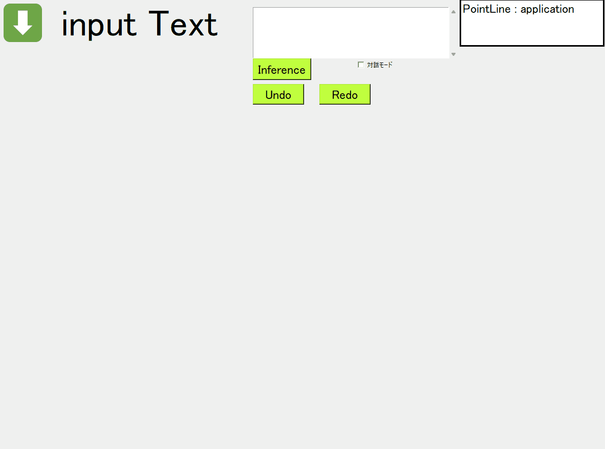

# PointLine-LLM
## 概要
  

PointLineとLLMを活用することによって、言語情報から幾何要素を抽出しそれらの可視化を行う。  
上のデモ環境ではOpenAIの提供するファインチューニングモデル(gpt-4o-2024-08-06)を使用している。  
このリポジトリは学習に使用したデータセットとそのデータセットの作成プログラムを提供する。

## データセットの説明
主に以下の３つに分かれている。
- word: 特徴的な図形や専門的な用語のみ含むもの
- short: 基本的な言語情報からオブジェクトやモジュールを適切に出力できるか試すもの
- problem: 教科書や問題集で見るような実践的な内容のもの
## データセットの作成
1. pythonの仮想環境を作成し、requirements.txtから必要なパッケージをインストールする。  
(2024 11/23時点ではインストールが必要なパッケージはないためこのステップはとばしても良い)  
`pip install -r requirements.txt`
1. 以下のコマンドを入力して、OpenAIが提供するファインチューニングモデルに学習させるデータセットを作成する。  
`python ./dataset/create_dataset.py`  

正常に実行できれば、dataset下に`testcase.jsonl`という名のファイルが出力される。  

